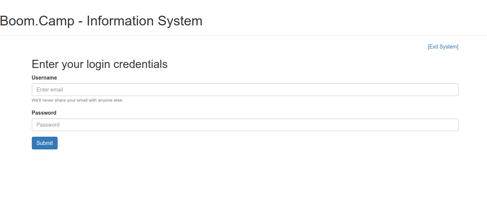
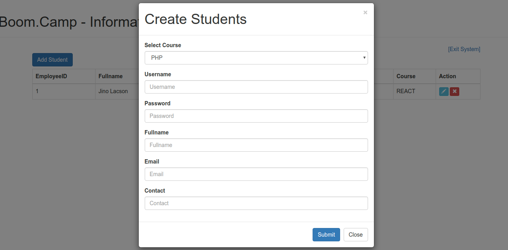
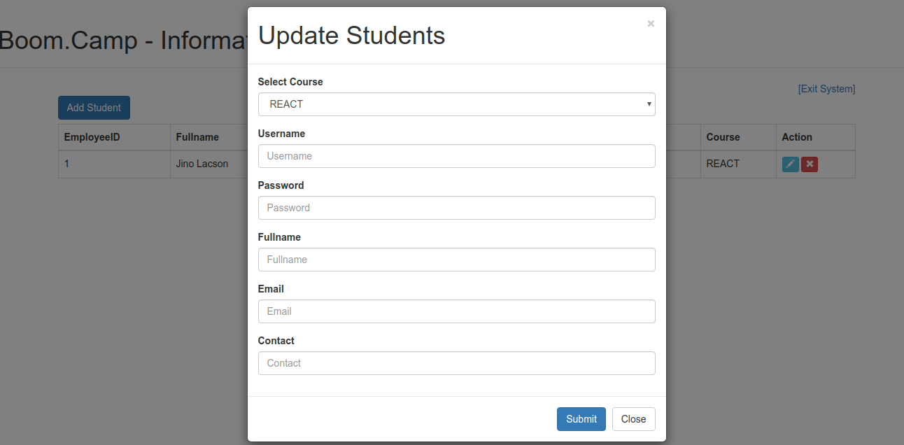
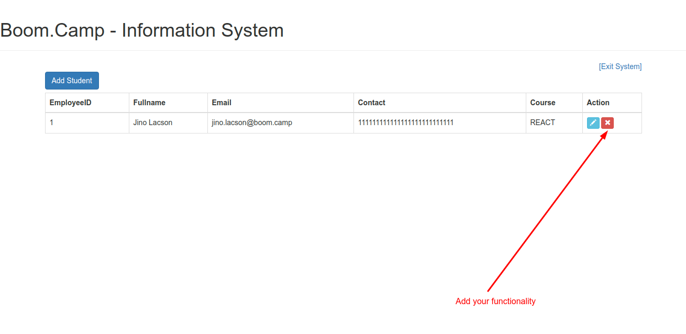

<h1 id="isystem">MVC - Information System </h1>

This is your first MVC activity in which you are going to complete the `missing functionalities` of our `isystem` below are the important parts that you should aware of in developing a codeigniter applications:


## Routes

It's always necessary to add a readable format in your application's url the basic segments in codeigniter is `hostname/controller/function/parameter1/parameter2`

## Model

Codeigniter models holds data layer and business logic of your application  `isystem/application/Imodel.php`

## Controller

Controller holds all the system process example of that is login/logout process `isystem/application/Icontroller.php`

## Libraries and helpers

Codeigniter supports custom `libraries` and `helpers` it is located under `isytem/application/libraries` and `isytem/application/helpers` and can be loaded inside your controllers `constructor`

Example on how to load helpers

```
public function __construct() 
{
  parent::__construct();
  //Message: Call to undefined function base_url()
  $this->load->helper('url'); 

  //Message: Call to undefined function ouput_to_json()
  $this->load->helper('isystem_helper');
}
```

## Screenshots

Here are the example of forms that you need to complete the functionalities:

Login/Exit System Page:



Create Page:



Update Page:



Delete Page:




## The views and scripts

Codeiniter support templating and it is located under the `views` folder.

* `/views/includes/header.php - The page header of the system it includes necessary scripts to be used by the system

* `/views/includes/footer.php - Application footer

* `/views/pages/login.php - The login form of the system

* `/views/pages/list.php - Display all students in a table

* `/views/pages/create.php - The create student form

* `/views/pages/update.php - The update student form


# The Initial SetUp

In order to run the application you need to configure the `url segment` and`database connection` accordingly.

1.) Download codeigniter and extract it inside your `/opt/lampp/htdocs` folder then rename it as `isystem`

2.) Update your `isytem/application/config.php` .

<details>
<summary> isytem/application/config.php </summary>

```
$config['index_page'] = '';

$config['base_url'] = 'http://localhost/isystem/';
```

</details>

3.) Add `.htaccess` inside your root directory `isystem/.htaccess` this will remove the `index.php` in the url.

<details>
<summary> isystem/.htaccess </summary>
	
```
RewriteEngine on
RewriteCond $1 !^(index\.php|resources|robots\.txt)
RewriteCond %{REQUEST_FILENAME} !-f
RewriteCond %{REQUEST_FILENAME} !-d
RewriteRule ^(.*)$ index.php/$1 [L,QSA]
```

</details>

4.) Create your database `info_db` in your [phpmyadmin](http://localhost/phpmyadmin).

<details>
<summary> table(s) </summary>
	
```	
users - id, username, password
courses - id, name (PHP, REACT, PYTHON)
students - id, user_id, course_id, fullname, email, contact
```

</details>

4.) Configure your database adapter `isytem/application/database.php`.

<details>
<summary> isytem/application/database.php </summary>
	
```
<?php
defined('BASEPATH') OR exit('No direct script access allowed');
$active_group = 'default';
$query_builder = TRUE;

$db['default'] = array(
	'dsn'	=> '',
	'hostname' => 'localhost',
	'username' => 'root',
	'password' => '',
	'database' => 'info_db',
	'dbdriver' => 'mysqli',
	'dbprefix' => '',
	'pconnect' => FALSE,
	'db_debug' => (ENVIRONMENT !== 'production'),
	'cache_on' => FALSE,
	'cachedir' => '',
	'char_set' => 'utf8',
	'dbcollat' => 'utf8_general_ci',
	'swap_pre' => '',
	'encrypt' => FALSE,
	'compress' => FALSE,
	'stricton' => FALSE,
	'failover' => array(),
	'save_queries' => TRUE
);

```
</details>

# The templates

<details>
<summary>  isystem/application/views/includes/header.php </summary>
	
```
<!DOCTYPE html>
<html>
<head>
  <title>Boom Camp - System</title>
  <meta charset="utf-8">
  <meta name="viewport" content="width=device-width, initial-scale=1">
  <link rel="stylesheet" href="https://maxcdn.bootstrapcdn.com/bootstrap/3.4.1/css/bootstrap.min.css">
  <script src="https://ajax.googleapis.com/ajax/libs/jquery/3.4.1/jquery.min.js"></script>
  <script src="https://maxcdn.bootstrapcdn.com/bootstrap/3.4.1/js/bootstrap.min.js"></script>
  <link rel="stylesheet" type="text/css" href="https://cdnjs.cloudflare.com/ajax/libs/toastr.js/latest/css/toastr.min.css" />

    <script>

    	  //base url for the script
    	  var url = "<?php echo base_url(); ?>";


    	  /**
    	   * A function call that will show "Create Students" form
    	   */
		  function showCreateForm()
		  {
		  	$('#createStudents').modal('show');
		  }

		  /**
    	   * A function call that will show "Update Students" form
    	   */
		  function showEditForm(student_id,course_id)
		  {
		  	$('#updateStudents').modal('show');
		  	$('select#course_update option[value="'+course_id+'"]').attr("selected",true);
		  }


		  /************************************************
		   ************************************************
		   * 			COMPLETE THE CODE BELOW..
		   * **********************************************
		   ***********************************************/
		  
		   /**
		    * A function call that will allow you to use the Isystem
		    */
		  function processLogin(e)
		  {

		  	e.preventDefault();
		  	
		  	//url  			:   url+"login"
		  	//controller	:   Icontroller/processLogin
		  	//message		: 	toastr.info('Login Success!')
		  	//formdata		: 	$("#loginDetails").serialize();
		  	
		  	//Complete with ajax code here..
		  }

		  /**
		   * A function call that will exit users from system
		   */
		  function processLogout()
		  {

		  	//url  			:   url+"logout"
		  	//controller	:   Icontroller/processLogout
		  	//message		: 	toastr.info('Loging out..')
		  	
		  	//Complete with ajax code here..
		  }

		  /**
		   * A function call that will create new student information in database
		   */
		  function createStudents(e)
		  {

		  	e.preventDefault();

		  	//url  			:   url+"create"
		  	//controller	:   Icontroller/createStudents
		  	//message		: 	toastr.info('Student successfully added!')
		  	//formdata		: 	$("#formCreate").serialize();
		  	
		  	//Complete with ajax code here..
		  }

		  /**
		   *  A function call that will update existing student information
		   */
		  function updateStudents(e)
		  {

		  	e.preventDefault();

		  	//url  			:   url+"update"
		  	//controller	:   Icontroller/updateStudents
		  	//message		: 	toastr.info('Student successfully updated')
		  	//formdata		: 	$("#formUpdate").serialize();
		  	
		  	//Complete with ajax code here..
		  }

		  /**
		   * A function call that will remove student information in the database
		   */
		  function deleteStudents(student_id)
		  {

		  	//url  			:   url+"delete"
		  	//controller	:   Icontroller/deleteStudents
		  	//message		: 	toastr.info('Student successfully deleted')
		  	//formdata		: 	$("#formUpdate").serialize();
		  	
		  	//Complete with ajax code here..
		  }


		 
    </script>

</head>
<body>
<div class="page-header">
  <h1>Boom.Camp - Information System</h1>
</div>
<div class="container"> <a style="float:right;">[Exit System]</a> <br>
```
	
</details>


<details>
<summary>   isystem/application/views/includes/footer.php </summary>

```
</div>
</body>
</html>
```

</details>


<details>
<summary>   isystem/application/views/pages/login.php </summary>

```
<h2>Enter your login credentials</h2>
<form id="loginDetails">
  <div class="form-group">
    <label for="email">Username</label>
    <input type="email" class="form-control" id="email" aria-describedby="emailHelp" placeholder="Enter email" name="username">
    <small id="emailHelp" class="form-text text-muted">We'll never share your email with anyone else.</small>
  </div>
  <div class="form-group">
    <label for="password">Password</label>
    <input type="password" class="form-control" id="password" placeholder="Password" name="password">
  </div>
  <button type="submit" class="btn btn-primary" onclick="processLogin(event);">Submit</button>
</form>
```

</details>


<details>
<summary>   isystem/application/views/pages/list.php </summary>


```
<div class="row">
    <div class="col-lg-12">                     
            <div class="pull-left">
               <a class="btn btn-primary" onclick="showCreateForm()">Add Student</a>
            </div>
     </div><br><br>
</div>
<div class="table-responsive">
<table class="table table-bordered">
  <thead>
      <tr>
          <th>EmployeeID</th>
          <th>Fullname</th>
          <th>Email</th>
          <th>Contact</th>
          <th>Course</th>
          <th>Action</th>
      </tr>
  </thead>
  <tbody>
   <?php foreach ($students as $student) { ?>      
      <tr>
          <td><?php echo $student->id; ?></td>
          <td><?php echo $student->fullname; ?></td>
          <td><?php echo $student->email; ?></td>   
          <td><?php echo $student->contact; ?></td>   
          <td><?php echo $student->course; ?></td>                        
      <td>
         <a class="btn btn-info btn-xs" onclick="showEditForm('<?php echo $student->id;?>','<?php echo $student->course_id;?>')"><i class="glyphicon glyphicon-pencil"></i>
         </a>
          <button type="submit" class="btn btn-danger btn-xs"><i class="glyphicon glyphicon-remove"></i></button>
      </td>     
      </tr>
      <?php } ?>
  </tbody>
</table>
</div>


<!-- Load necessary forms -->
<?php 
$this->load->view('pages/create');
$this->load->view('pages/update');
?>
```
</details>

<details>
<summary>   isystem/application/views/pages/create.php </summary>
	
```
<form id="formCreate">
    <div class="modal fade" id="createStudents" role="dialog">
    <div class="modal-dialog">
      <div class="modal-content">
        <div class="modal-header">
          <button type="button" class="close" data-dismiss="modal">&times;</button>
          <h1 class="modal-title">Create Students</h1>
        </div>
        <div class="modal-body">
           <div class="form-group">
            <label for="course">Select Course</label>
            <select class="form-control" id="course" name="course">
              <?php foreach($course as $courses):?>
                <?php echo "<option>{$courses->name}</option>"; ?>
              <?php endforeach;?>
            </select>
          </div>
          <div class="form-group">
            <label for="username">Username</label>
            <input type="password" class="form-control" id="username" placeholder="Username" name="username">
          </div>
          <div class="form-group">
            <label for="password">Password</label>
            <input type="password" class="form-control" id="password" placeholder="Password" name="password">
          </div>
          <div class="form-group">
            <label for="fullname">Fullname</label>
            <input type="fullname" class="form-control" id="fullname" placeholder="Fullname" name="fullname">
          </div>
          <div class="form-group">
            <label for="email">Email</label>
            <input type="email" class="form-control" id="email" placeholder="Email" name="email">
          </div>
          <div class="form-group">
            <label for="contact">Contact</label>
            <input type="contact" class="form-control" id="contact" placeholder="Contact" name="contact">
          </div>
        </div>
        <div class="modal-footer">
          <button type="button" class="btn btn-primary" onclick="createStudents(event)">Submit</button>
          <button type="button" class="btn btn-default" data-dismiss="modal">Close</button>
        </div>
      </div> 
    </div>
  </div>
</form>
```
</details>

<details>
<summary>   isystem/application/views/pages/update.php </summary>

```
<form id="formUpdate">
    <div class="modal fade" id="updateStudents" role="dialog">
    <div class="modal-dialog">
      <div class="modal-content">
        <div class="modal-header">
          <button type="button" class="close" data-dismiss="modal">&times;</button>
          <h1 class="modal-title">Update Students</h1>
        </div>
        <div class="modal-body">
           <div class="form-group">
            <label for="course">Select Course</label>
            <select class="form-control" id="course_update" name="course">
              <?php foreach($course as $courses):?>
                <?php echo "<option value='{$courses->id}'>{$courses->name}</option>"; ?>
              <?php endforeach;?>
            </select>
          </div>
          <div class="form-group">
            <label for="username">Username</label>
            <input type="password" class="form-control" id="username_update" placeholder="Username" name="username">
          </div>
          <div class="form-group">
            <label for="password">Password</label>
            <input type="password" class="form-control" id="password_update" placeholder="Password" name="password">
          </div>
          <div class="form-group">
            <label for="fullname">Fullname</label>
            <input type="fullname" class="form-control" id="fullname_update" placeholder="Fullname" name="fullname">
          </div>
          <div class="form-group">
            <label for="email">Email</label>
            <input type="email" class="form-control" id="email_update" placeholder="Email" name="email">
          </div>
          <div class="form-group">
            <label for="contact">Contact</label>
            <input type="contact" class="form-control" id="contact_update" placeholder="Contact" name="contact">
          </div>
        </div>
        <div class="modal-footer">
          <button type="button" class="btn btn-primary" onclick="updateStudents(event)">Submit</button>
          <button type="button" class="btn btn-default" data-dismiss="modal">Close</button>
        </div>
      </div> 
    </div>
  </div>
</form>
```

</details>

# Routes, Controllers, Models and Helpers

<details>
<summary> isystem/application/config/routes.php </summary>

```
<?php
defined('BASEPATH') OR exit('No direct script access allowed');

$route['default_controller'] = 'welcome';
$route['404_override'] = '';
$route['translate_uri_dashes'] = FALSE;


$route["home"] = "Icontroller/index";
$route["login"] = "Icontroller/processLogin";
$route["logout"] = "Icontroller/processLogout";
$route["dashboard"] = "Icontroller/dashboard";
$route["create"] = "Icontroller/createStudents";
$route["update"] = "Icontroller/updateStudents";
$route["delete"] = "Icontroller/deleteStudents";
```
	
</details>


<details>
<summary>  isystem/application/controllers/Icontroller.php </summary>

```
<?php
defined('BASEPATH') OR exit('No direct script access allowed');

class Icontroller extends CI_Controller {

	public function __construct() 
    {
        parent::__construct();
        //Message: Call to undefined function base_url()
        $this->load->helper('url'); 

        //Message: Call to undefined function ouput_to_json()
        $this->load->helper('isystem_helper');
        
        //load model
        $this->load->model("Imodel");

    }

    /**
     * Display login view
     */
    public function index()
    {
    	$this->load->view("includes/header");
    	$this->load->view("pages/login");
    	$this->load->view("includes/footer");
    }


	/************************************************
	************************************************
	* 			COMPLETE THE CODE BELOW..
	* **********************************************
	***********************************************/

	/**
	 * The main page that display student information
	 */
    public function dashboard()
    {
    	//Create function that will login page if session is not present.
    	
    	$data['students'] = $this->Imodel->get_students();
    	$data['course'] = $this->Imodel->get_course();

    	$this->load->view("includes/header");
    	$this->load->view("pages/list", $data);
    	$this->load->view("includes/footer");
    }

    /**
     * Function that establish a session to Isystem
     */
    public function processLogin()
    {
    	# Session: https://codeigniter.com/user_guide/libraries/sessions.html#using-the-session-class
 		//use function $this->Imodel->roleExist() from Imodel to check if username and password is match from the database
 		//IF response is equal to 1 use ouput_to_json([ "message" => "Login success!"]) to display the message
 		//use codeigniter session or cookie to store login credentials  then redirect to dashboard
 		//ELSE display ouput_to_json([ "message" => "Login failed!"])
 		

 		redirect(base_url('dashboard'), 'refresh');
    }

    /**
     * A function that will exit you from system
     */
    public function processLogout()
    {
    	# Session: https://codeigniter.com/user_guide/libraries/sessions.html#using-the-session-class
    	//Destroy all CI sessions from system
    	
    	redirect(base_url("home"), 'refresh');
    }

    /**
     * A function that will insert student details
     */
    public function createStudents()
    {

    	//Call model $this->Imodel->create_students(); to insert student details
    	//Display ouput_to_json([ "message" => "Student created"]) to inform that new record was inserted
    	
    	redirect(base_url('dashboard'), 'refresh');
    }

    /**
     * A function that will update student details
     */
    public function updateStudents()
    {

    	//Call model $this->Imodel->update_students(); to update student details
    	//Display ouput_to_json([ "message" => "Update success"]) to inform the updates
    	
    	redirect(base_url('dashboard'), 'refresh');
    }

    public function deleteStudents()
    {

    	//Call model $this->Imodel->delete_students(); to delete student details
    	//Display ouput_to_json([ "message" => "Update success"]) to inform the updates
    	
    	redirect(base_url('dashboard'), 'refresh');
    }
}


```

</details>


<details>
<summary>  isystem/application/models/Imodel.php </summary>

```
<?php
defined('BASEPATH') OR exit('No direct script access allowed');

class Imodel extends CI_Model{
    
    public function __construct() 
    {
        parent::__construct();
        $this->load->database();
    }

    public function roleExist($username, $password) : bool
    {
        $this->db->where('username',$username);
        $this->db->where('password', sha1($password));
        $query = $this->db->get('users');
        return $query->num_rows() > 0 ?? false ;
    }

    public function get_course() : array
    {
        $this->db->select('id, name');
        $this->db->from('course');
        return $this->db->get()->result();
    }

    public function get_students() : array
    {
        $this->db->select('students.id, students.fullname, students.email, students.contact, course.name as course, course.id as course_id');
        $this->db->from('students');
        $this->db->join('users', 'users.id = students.user_id');
        $this->db->join('course', 'course.id = students.course_id');
        return $this->db->get()->result();
    }

    /**
     *  PLEASE COMPLETE THE CODE BELOW AND ADD PROPER RETURN TYPE 
     */
    

    public function add_students()
    {    
        //Insert query here..
        //https://codeigniter.com/user_guide/database/query_builder.html#inserting-data
    }

    public function update_students()
    {    
        //Update query here..
        //https://codeigniter.com/user_guide/database/query_builder.html#updating-data
    }

    public function delete_students()
    {
        //Delete query here..
        //https://codeigniter.com/user_guide/database/query_builder.html#deleting-data
    }
}
?>

```

</details>


<details>
<summary>  isystem/application/helpers/isystem_helper.php </summary>

```
<?php 

function ouput_to_json($result)
{
	$CI =& get_instance();
	return $CI->output
    		  ->set_content_type('application/json') 
    		  ->set_output(json_encode($result));
}


function emptyArray($obj)
{
	if(!is_array($obj) || !is_object($obj)){
		return [];
	}

	return [];
}
```
 
</details>


# Finished

Submit a link of your github repository to the Google Classroom assignment related to this project.


